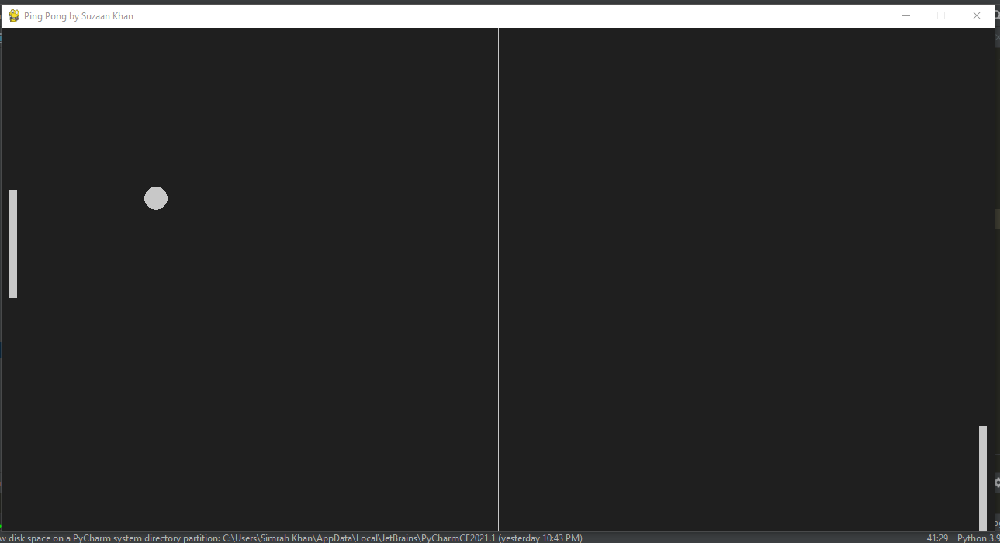

# Ping-Pong-Game-in-Python
This is again a ping pong game but in python and has only one player, the other player is AI. Use UP ARROW KEY and DOWN ARROW KEY. It has sound effects when ball collides with the slider. However its not fully complete, it does not have logic for game over XD. The left side bar is the player while the right bar is automated.

# GamePlay (not laggy,used a better screenRec :) )
https://github.com/user-attachments/assets/c41b3570-f625-4fd1-9208-46bd69bf5bd8

## Game

